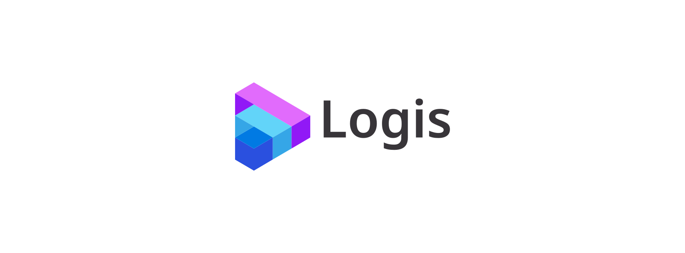

# Logis

### Time Travel Dashboard

**Logis** is an open-source log visualization and time-travel dashboard built with **Next.js** and **Tailwind CSS**.  
It lets you load application logs, scrub through time like a video editor, and see the **system state at any moment**.
Perfect for debugging, replaying, and understanding event-driven systems.



With Logis, you can connect a log file (e.g., from Winston or any structured logger) or stream live logs, then explore
your application state via a **scrubbable timeline**. Each UI card represents a part of your system (orders, calls,
sessions, etc.) and updates instantly when you move back or forward in time.

Logis leverages the powerful features of **Next.js 15**, the advancements of **React 19**, and the robustness of *
*TypeScript** to give developers a fast, modern, and extensible platform for log analysis.

---

## Overview

Logis is designed to help you **replay and inspect system behavior**:

- Ingest log files or live streams (e.g., Winston, JSON logs).
- Organize logs into indexed **event types** for fast queries.
- Scrub through time to see the **true state** at any timestamp.
- Build custom **UI cards** that react to log events (e.g., "Phone State", "Orders Placed", "Active Sessions").
- Switch between **rolling metrics** (last 5 minutes, today, etc.) and full history.

It’s built on:

- Next.js 15.x
- React 19
- TypeScript
- Tailwind CSS v4

---

## Installation

### Prerequisites

Make sure you have:

- Node.js 18.x or later (Node.js 20.x recommended)

### Clone the Repository

```bash
git clone https://github.com/your-org/logis.git
```

Install dependencies:

```bash
cd logis
npm install
```

Run locally:

```bash
npm run dev
```

Features

Logis provides the building blocks for time-travel debugging dashboards:
• 🎚️ Timeline Slider – scrub back and forth in time
• 🔍 Fast Log Indexing – event types stored in optimized buckets
• 📊 Dashboard Cards – custom React components that render state from logs
• 📈 Data Visualization – charts, tables, and KPIs
• 🕶️ Dark Mode – because logs are cooler in the dark
• ⚡ Live Log Support – append events as they happen


Example Use Cases
• Debugging call flows (pickup / hangup events).
• Inspecting order lifecycles (placed, cancelled, shipped).
• Monitoring session activity or feature usage.
• Teaching event-sourced systems and time-travel debugging.

## License

Logis is released under the MIT License.

## Support

If Logis helps you debug or build faster, please ⭐ star the repository.
Your support helps us improve and maintain this project!